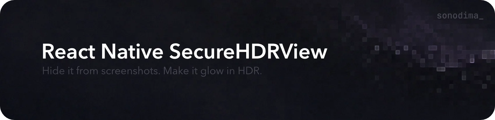

<p align="center">
  <a href="https://github.com/sonodima/react-native-secure-hdr-view/actions/workflows/ci.yml"></a>
  <a href="https://www.npmjs.com/package/react-native-secure-hdr-view"></a>
  <a href="LICENSE"></a>
</p>

<p align="center">
A React Native view that can hide its content from screenshots and screen recordings, and show it in HDR.
</p>

```tsx
import { SecureHDRView } from 'react-native-secure-hdr-view';

<SecureHDRView secure hdr style={{ borderRadius: 12 }}>
  <View style={{ padding: 12, backgroundColor: 'white' }}>
    <QRCode value={token} size={200} />
  </View>
</SecureHDRView>
```

## Installation

```sh
npm install react-native-secure-hdr-view
yarn add react-native-secure-hdr-view
pnpm add react-native-secure-hdr-view
npx expo install react-native-secure-hdr-view
```

Then rebuild the native app. With Expo, a development build is required.

## Requirements

- React Native 0.77+ with the New Architecture, or Expo SDK 53+
- iOS 15.1+ and Android 7.0+
- `hdr` also needs an HDR display, on iOS 17+ or Android 13+. Elsewhere the content is shown normally.

## Props

- `secure`: hide the content from screenshots and screen recordings.
- `hdr`: show the content brighter than SDR white. `true` is the brightest the display allows, a number from 0 to 1 sets the intensity.

`style` takes layout, corner radius and shadows. Put backgrounds, borders and outlines on a child, so they are protected and brightened too.

## Example

```sh
pnpm install
cd example && pnpm ios
```

## License

MIT
